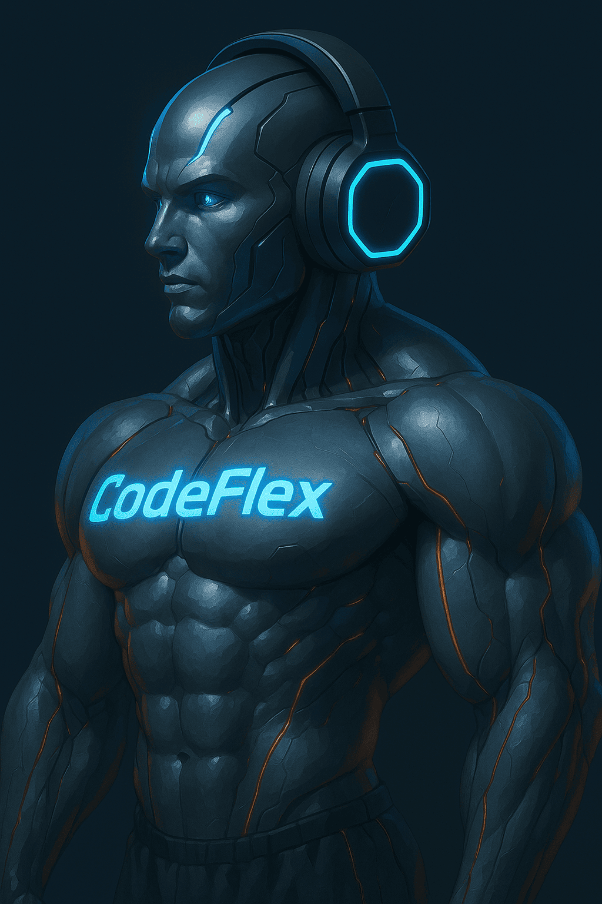
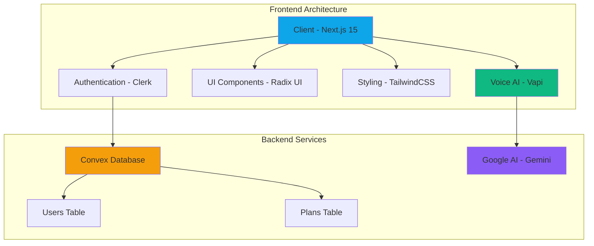

# 🏋️ Gym Buddy - AI-Powered Fitness Companion

<div align="center">
  
  
  **Transform Your Body With Advanced AI Technology**
  
  [](https://nextjs.org/)
  [](https://www.typescriptlang.org/)
  [](https://convex.dev/)
  [](https://clerk.com/)
  [](https://vapi.ai/)
  [](https://tailwindcss.com/)
</div>

## 🚀 Overview

Gym Buddy is a cutting-edge AI-powered fitness application that provides personalized workout routines and diet plans through an interactive voice assistant. Built with modern web technologies, it delivers a cyberpunk-themed, responsive user experience with real-time AI conversations.

### ✨ Key Features

- 🤖 **AI Voice Assistant**: Interactive voice-powered workout planning using Vapi AI
- 🎯 **Personalized Programs**: Custom workout and diet plans based on user goals
- 📱 **Responsive Design**: Cyberpunk-themed UI optimized for all devices
- 🔐 **Secure Authentication**: Clerk-powered user management
- 💾 **Real-time Database**: Convex backend for instant data synchronization
- 📊 **Progress Tracking**: Monitor fitness journey with detailed analytics
- 🎨 **Modern UI**: Sleek interface with animations and terminal-style overlays

## 🏗️ Architecture Overview



## 📁 Project Structure

```
gym-buddy/
├── 📱 src/
│   ├── 🎨 app/                    # Next.js App Router
│   │   ├── (auth)/               # Authentication pages
│   │   │   ├── sign-in/          # Sign-in page
│   │   │   └── sign-up/          # Sign-up page
│   │   ├── generate-program/     # AI program generation
│   │   ├── profile/              # User profile & plans
│   │   ├── layout.tsx           # Root layout
│   │   ├── page.tsx             # Home page
│   │   └── globals.css          # Global styles
│   ├── 🧩 components/            # Reusable UI components
│   │   ├── ui/                  # Shadcn/ui components
│   │   ├── Navbar.tsx           # Navigation component
│   │   ├── Footer.tsx           # Footer component
│   │   ├── TerminalOverlay.tsx  # Cyberpunk terminal UI
│   │   ├── UserPrograms.tsx     # Program display
│   │   └── ProfileHeader.tsx    # Profile header
│   ├── 🔧 lib/                   # Utility libraries
│   │   ├── utils.ts             # Helper functions
│   │   └── vapi.ts              # Vapi AI configuration
│   ├── 🎯 constants/             # App constants
│   │   └── index.ts             # Sample data & constants
│   └── 🔌 providers/             # Context providers
│       └── ConvexClerkProvider.tsx # Auth + DB provider
├── 🗄️ convex/                    # Convex backend
│   ├── schema.ts                # Database schema
│   ├── auth.config.ts           # Auth configuration
│   ├── plans.ts                 # Plans CRUD operations
│   ├── users.ts                 # User management
│   └── _generated/              # Auto-generated files
├── 🖼️ public/                    # Static assets
│   ├── hero-ai.png              # Hero images
│   ├── ai-avatar.png            # AI avatar
│   └── *.png                    # Other images
├── ⚙️ Configuration Files
│   ├── next.config.ts           # Next.js config
│   ├── tailwind.config.js       # TailwindCSS config
│   ├── tsconfig.json            # TypeScript config
│   ├── package.json             # Dependencies
│   └── eslint.config.mjs        # ESLint config
```

## 🔧 Tech Stack

### Frontend

- **Framework**: Next.js 15 with App Router
- **Language**: TypeScript 5.0
- **Styling**: TailwindCSS 4.0 with custom cyberpunk theme
- **UI Components**: Radix UI primitives
- **Icons**: Lucide React

### Backend & Database

- **Database**: Convex (Real-time database)
- **Authentication**: Clerk
- **Voice AI**: Vapi AI with Google Gemini integration

### Key Dependencies

```json
{
  "dependencies": {
    "@clerk/nextjs": "^6.19.4",
    "@google/generative-ai": "^0.24.1",
    "@vapi-ai/web": "^2.3.0",
    "convex": "^1.24.1",
    "next": "15.2.4",
    "react": "^19.0.0",
    "tailwindcss": "^4"
  }
}
```

## 🎯 Core Features Deep Dive

### 1. AI Voice Assistant

- **Interactive Conversations**: Real-time voice interaction for workout planning
- **Natural Language Processing**: Understands user fitness goals and preferences
- **Personalization**: Adapts recommendations based on user profile

### 2. Workout Program Generation

- **Custom Routines**: AI-generated workouts based on:
  - Fitness level (Beginner, Intermediate, Advanced)
  - Available equipment (Home gym, Commercial gym, Bodyweight)
  - Time constraints and schedule
  - Specific goals (Weight loss, Muscle gain, Endurance)
  - Physical limitations and injuries

### 3. Diet Planning

- **Nutritional Guidance**: Personalized meal plans with:
  - Caloric calculations based on goals
  - Macro-nutrient distribution
  - Dietary restrictions accommodation
  - Meal timing recommendations

### 4. User Profile Management

- **Progress Tracking**: Monitor fitness journey over time
- **Plan History**: Access to all previously generated programs
- **Active Plan Management**: Switch between different workout plans
- **Personal Information**: Height, weight, age, and goal tracking

## 🎨 UI/UX Design

### Cyberpunk Theme

- **Color Palette**: Electric blues, neon greens, and cyber oranges
- **Typography**: Geist Sans with monospace accents
- **Animations**: Smooth transitions and hover effects
- **Visual Elements**:
  - Scan lines and grid patterns
  - Terminal-style overlays
  - Gradient backgrounds
  - Corner decorative elements

### Responsive Design

- **Mobile-First**: Optimized for all screen sizes
- **Touch-Friendly**: Large buttons and intuitive navigation
- **Accessibility**: ARIA labels and keyboard navigation support

## 🚀 Getting Started

### Prerequisites

- Node.js 18.0 or higher
- npm, yarn, or pnpm
- Convex account
- Clerk account
- Vapi AI account

### Installation

1. **Clone the repository**

```bash
git clone https://github.com/MaximumCell/gym-buddy.git
cd gym-buddy
```

2. **Install dependencies**

```bash
npm install
# or
yarn install
# or
pnpm install
```

3. **Set up environment variables**

```bash
cp .env.example .env.local
```

Add your API keys:

```env
NEXT_PUBLIC_CONVEX_URL=your_convex_url
NEXT_PUBLIC_CLERK_PUBLISHABLE_KEY=your_clerk_publishable_key
CLERK_SECRET_KEY=your_clerk_secret_key
NEXT_PUBLIC_VAPI_API_KEY=your_vapi_api_key
```

4. **Set up Convex**

```bash
npx convex dev
```

5. **Run the development server**

```bash
npm run dev
# or
yarn dev
# or
pnpm dev
```

6. **Open the application**
   Navigate to [http://localhost:3000](http://localhost:3000) in your browser.

## 📊 Database Schema

### Users Table

```typescript
users: {
  name: string;
  email: string;
  image?: string;
  clerkId: string;
}
```

### Plans Table

```typescript
plans: {
  userId: string;
  name: string;
  workoutPlan: {
    schedule: string[];
    exercises: {
      day: string;
      routines: {
        name: string;
        sets?: number;
        reps?: number;
        duration?: string;
        description?: string;
      }[];
    }[];
  };
  dietPlan: {
    dailyCalories: number;
    meals: {
      name: string;
      foods: string[];
    }[];
  };
  isActive: boolean;
}
```

## 🔌 API Integration

### Vapi AI Voice Assistant

- **Real-time voice conversations**
- **Natural language understanding**
- **Custom prompts for fitness coaching**
- **Error handling for connection issues**

### Google Gemini AI

- **Advanced workout generation**
- **Nutritional advice**
- **Personalized recommendations**

### Convex Real-time Database

- **Instant data synchronization**
- **Optimistic updates**
- **Automatic caching**

## 📱 Pages Overview

### Home Page (`/`)

- Hero section with AI showcase
- Feature highlights
- Call-to-action for program generation
- User statistics and testimonials

### Generate Program (`/generate-program`)

- Voice AI interaction interface
- Real-time conversation display
- Program generation workflow
- Error handling and reconnection

### Profile (`/profile`)

- User information display
- Active and historical plans
- Plan switching functionality
- Progress tracking

### Authentication (`/sign-in`, `/sign-up`)

- Clerk-powered authentication
- Social login options
- Secure user onboarding

## 🎯 Key Components

### `TerminalOverlay.tsx`

Cyberpunk-style terminal interface showing:

- System status indicators
- Workout analysis results
- Animated scan lines
- Real-time updates

### `UserPrograms.tsx`

Program display component featuring:

- Plan cards with workout details
- Diet plan visualization
- Progress tracking
- Interactive plan switching

### `Navbar.tsx`

Navigation component with:

- Responsive design
- User authentication status
- Mobile menu support
- Smooth animations

## 🚀 Deployment

### Environment Setup

1. **Production environment variables**
2. **Convex production deployment**
3. **Clerk production settings**
4. **Vapi AI production keys**

### Deployment Platforms

- **Vercel** (Recommended for Next.js)
- **Netlify**
- **Railway**
- **Docker containers**

## 🔮 Future Enhancements

### Planned Features

- [ ] **Workout Video Integration**: Exercise demonstration videos
- [ ] **Progress Photos**: Visual progress tracking
- [ ] **Social Features**: Share workouts with friends
- [ ] **Wearable Integration**: Sync with fitness trackers
- [ ] **Nutrition Tracking**: Barcode scanning for food logging
- [ ] **AI Form Checker**: Real-time exercise form analysis
- [ ] **Community Challenges**: Group fitness challenges
- [ ] **Offline Mode**: Downloadable workout plans

### Technical Improvements

- [ ] **Progressive Web App**: Offline capabilities
- [ ] **Push Notifications**: Workout reminders
- [ ] **Performance Optimization**: Image optimization and lazy loading
- [ ] **Analytics Integration**: User behavior tracking
- [ ] **A/B Testing**: Feature experimentation
- [ ] **Internationalization**: Multi-language support

## 🤝 Contributing

We welcome contributions! Please follow these steps:

1. **Fork the repository**
2. **Create a feature branch**: `git checkout -b feature/amazing-feature`
3. **Commit your changes**: `git commit -m 'Add amazing feature'`
4. **Push to the branch**: `git push origin feature/amazing-feature`
5. **Open a Pull Request**

### Development Guidelines

- Follow TypeScript best practices
- Use conventional commit messages
- Add tests for new features
- Update documentation as needed
- Ensure responsive design compatibility

## 📄 License

This project is licensed under the MIT License. See the [LICENSE](LICENSE) file for details.

## 🙏 Acknowledgments

- **Vapi AI** for voice assistant capabilities
- **Convex** for real-time database infrastructure
- **Clerk** for authentication services
- **Google AI** for advanced language processing
- **Vercel** for hosting and deployment
- **Shadcn/ui** for beautiful UI components
- **TailwindCSS** for utility-first styling

## 📞 Support

For support, email support@gymbuddy.app or join our Discord community.

---

<div align="center">
  <p>Built with ❤️ by <a href="https://github.com/MaximumCell">MaximumCell</a></p>
  <p>Transform your fitness journey with AI-powered personalization</p>
</div>
